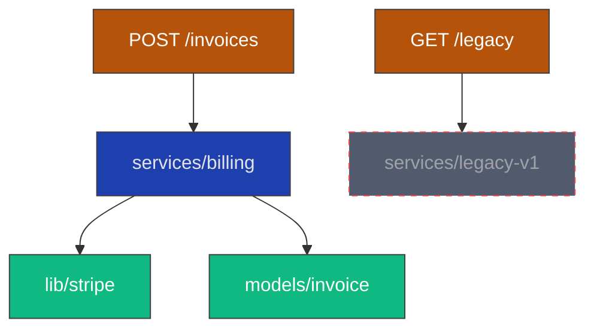

# 模板 03 · 通用代码项目鸟瞰站

> **适用项目**：SaaS Web 应用 / CLI 工具 / 数据管道 / Library / 任何代码项目（语言无关）
> **典型场景**：Next.js / FastAPI / Rails / Rust crate / Go service / Python data pipeline / Electron 桌面端
> **本质**：可视化 **module + API + dep + entity（如有）** 项目骨架 · 任何项目都能跑

---

## 何时用本模板

调研报告满足：
- `complexity_signals.complexity_tier in [medium, large, mega]`
- 多 module · API/路由多 · 复杂依赖
- **或** 调研发现 01/02 都不强匹配 → 03 作为兜底通用模板（任何项目都能跑）

不适用：
- prototype（单文件 / 极简脚本）→ 不需要建站
- 纯数据驱动游戏（已用 01）/ 纯文档库（已用 02）

---

## 产出物（4 件）

```
public/audit.html (or docs/audit.html)   ← 单文件 SPA · CDN 引 mermaid + marked · ~600 行
public/audit-data.json                    ← 项目地图数据
scripts/build_audit_data.<py|mjs>         ← 从源码生成 audit-data.json
scripts/audit-pre-commit.sh               ← 可选 · pre-commit 自动重生
```

---

## audit-data.json schema（03 模板专用）

跟 01 共用基础 schema（见 [`_schema-template.md`](_schema-template.md)）· 03 增加以下字段：

```json
{
  "generated": "2026-05-18T12:34:56Z",
  "schema_version": "1.0",
  "project": "<项目名>",
  "primary_language": "TypeScript",

  "stats": {
    "modules": 24,
    "apis": 18,
    "external_deps": 47,
    "internal_deps_edges": 89,
    "entities": 3,
    "tests": 156
  },

  "modules": [
    {
      "id": "services/billing",
      "path": "src/services/billing/",
      "kind": "service",
      "lines_of_code": 412,
      "lifecycle": "active",
      "depends_on": ["services/auth", "lib/stripe-client", "models/invoice"],
      "depended_by": ["routes/api/billing", "jobs/invoice-cron"],
      "exports": ["createInvoice", "voidInvoice", "computeTax"],
      "tests": ["tests/billing.test.ts"]
    },
    {
      "id": "services/legacy-billing-v1",
      "lifecycle": "deprecated",
      "deprecated_at": "2026-04-10",
      "deprecation_note": "迁到 services/billing · 等所有调用方迁完删除",
      "depends_on": [],
      "depended_by": ["routes/api/legacy-billing"],
      "stale_references_count": 1
    }
  ],

  "apis": [
    {
      "id": "POST /api/v1/invoices",
      "method": "POST",
      "path": "/api/v1/invoices",
      "handler": "routes/api/billing.createInvoice",
      "auth": "authMiddleware",
      "middleware": ["validateInput", "rateLimit"],
      "lifecycle": "active",
      "callers": ["frontend/checkout.tsx"]
    }
  ],

  "external_deps": [
    {
      "name": "stripe",
      "version": "14.5.0",
      "used_in": ["lib/stripe-client", "services/billing"],
      "lifecycle": "active",
      "last_version_check": "2026-05-01"
    },
    {
      "name": "old-payment-lib",
      "version": "2.1.0",
      "used_in": ["services/legacy-billing-v1"],
      "lifecycle": "deprecated",
      "removal_plan": "随 services/legacy-billing-v1 一起删"
    }
  ],

  "entities": [
    { "id": "User", "lifecycle": "active", "fields_count": 12, "relations": ["Subscription", "Invoice"] }
  ],

  "orphans": {
    "modules_no_callers": ["lib/old-util"],
    "apis_no_callers": ["GET /api/v1/legacy-endpoint"],
    "external_deps_no_usage": ["unused-npm-pkg"],
    "deprecated_with_refs": ["services/legacy-billing-v1"]
  }
}
```

---

## audit.html 实现要点

### 顶部 tabs（按项目类型动态生成 · 至少 3 个）

| Tab | 必备性 | 内容 |
|---|---|---|
| **模块图** | 必备 | Mermaid `flowchart TB` · 模块节点 + 依赖箭头 · classDef 按 kind 上色（service 蓝 / lib 绿 / route 橙 / model 紫） |
| **API 路由** | 有 API 的项目必备 | 路由树 (REST endpoints + middleware chain) · 表格 + 点击展开 handler 跳转 |
| **依赖图** | 必备 | external deps + internal deps · 内外两张图 |
| **实体** | 有 entity 的项目必备 | ER 图（Mermaid `erDiagram`）· DB schema |
| **孤儿清单** | 必备 | orphans 4 类全列 · 每条 + 行号引用 |
| **更改面** | 推荐 | 最近 30 天活跃模块 / API / dep 变化（来自 git log）|
| **测试覆盖** | 推荐 | 模块 ↔ 测试映射 · 找无测试模块 |

### 模块图 Mermaid 示例



### API 路由表

| Method | Path | Handler | Auth | Middleware | Lifecycle | Callers |
|---|---|---|---|---|---|---|
| POST | /api/v1/invoices | routes/api/billing.createInvoice | auth | validateInput, rateLimit | active | frontend/checkout.tsx |
| GET | /api/v1/legacy-endpoint | routes/api/legacy.get | optional | — | deprecated | （无 callers · 孤儿）|

### 孤儿清单（每条用红角标 + 上下文）

```
🔴 模块无 caller：lib/old-util
   - 最后修改：2025-11-03（6 个月前）
   - 历史 caller：services/old-billing-v0（commit a1b2c3 已删除）
   - 建议：删除或归档

🟡 deprecated 仍有 callers：services/legacy-billing-v1
   - 被 routes/api/legacy-billing 调用
   - deprecation_note：迁到 services/billing · 等所有调用方迁完删除
   - 建议：迁移 routes/api/legacy-billing 后删除
```

---

## build_audit_data 脚本逻辑（03 专用）

详见 [`_build-script-templates/`](_build-script-templates/) · 核心 7 步：

1. **扫模块**：按 `primary_language` 选解析器（JS = grep import + 简易 AST · Python = ast 模块 · Rust = cargo modules · Go = go list -deps）
2. **扫 API 路由**：按 framework 选 grep pattern（Express `router.get/post` · FastAPI `@app.get` · Rails `routes.rb` · Gin / Echo / Chi）
3. **扫 external deps**：从 lock file 提（package-lock.json / Cargo.lock / poetry.lock / go.sum）
4. **算 internal deps edges**：从 imports / use / mod / include 解
5. **扫 lifecycle 标记**：`grep "[AI-NOTE].*已删\|deprecated\|legacy"` + `git log --diff-filter=D --since="180 days"`
6. **算孤儿**：无 caller / 无 callee / deprecated with refs
7. **写 audit-data.json**

---

## 配色（跟 01/02 一致）

详见 [01_data-flow-audit-station.md](01_data-flow-audit-station.md) 「配色」段。

---

## AI 协作钩子（必跑）

跟 01 一样 · 详见 01 文档「AI 协作钩子」段。03 特有的检查：

- 新增 module 是否在 audit-data 出现（防 stale 鸟瞰）
- 删除 module 是否在 orphans 出现（防漏删 callers）
- API 路由新增 / 删除是否在 audit-data 更新
- external deps 升级 / 卸载是否同步

---

## 验证清单

- [ ] `public/audit.html` 浏览器打开 OK
- [ ] 模块图 Mermaid 渲染 · 节点按 kind 上色 · deprecated 节点虚线
- [ ] API 路由表完整 · 点 handler 能跳源码（可选）
- [ ] 孤儿清单 4 类都有数据（或显式标 "本项目无 X 类孤儿"）
- [ ] build script 跨平台 OK（macOS / Linux · Windows 视情况）
- [ ] 钩子接入审计夕潮 §6 SOP 步骤 5

---

## 跟 01 / 02 模板组合

- 03 单独用：SaaS Web / CLI / Library 类项目（无 CSV 实体 + 文档少）
- 03 + 01：游戏后端（CSV entity + 复杂代码 module）· 如 Godot + Go service + CSV 数据管道 等组合
- 03 + 02：内部工具 / 平台型项目（代码 + 文档密集）
- 03 + 01 + 02：复合型项目（如游戏向桌宠平台 = 代码 + CSV + 80+ 文档）

组合时 = 一个 `audit.html` · 顶部 tabs 加各模板的 tab 集合 · 共享一份 `audit-data.json`（schema 合并）。

---

## 兜底模式（任何冷门项目）

如果 03 模板 + 01/02 都不强匹配（极冷门：纯 ML 训练 / shader / 嵌入式固件 / 智能合约）：

→ 用 [`_customization-patterns.md`](_customization-patterns.md) 拼 pattern。

但**至少保证 3 个核心元素**（README 「兜底原则」段）：
1. Project Overview（项目骨架）
2. Stale Inventory（陈旧产物清单）
3. Change Surface（改动面）

这 3 个元素**任何项目都能产出**——只要项目有 git 历史 + 文件。
